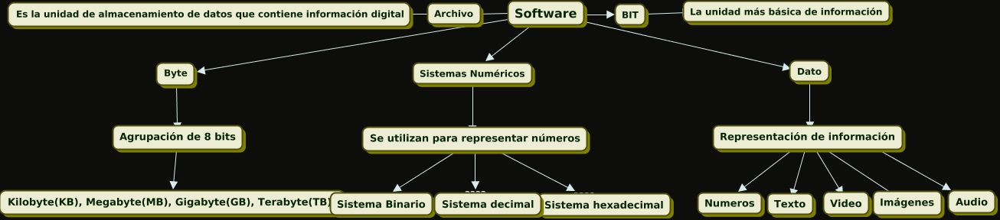

# CONCEPTOS BÁSICOS DE SOFTWARE

- **BIT:**
Es la mínima pulsación electrónica que recibe una computadora (bit, binary digit: dígito
binario); es decir, es la mínima cantidad de información (datos) que recibe una computadora y puede ser ya sea 0 o 1 y representa el estado de un dispositivo que puede tomar uno
de dos estados. Un foco puede estar apagado o encendido. El significado o representación
es la siguiente: 1 = encendido y 0 = apagado. Un interruptor electrónico puede representar
un bit. Actualmente las computadoras utilizan varios dispositivos binarios de dos estados
para almacenar datos

- **BYTE Y UNIDADES DERIVADAS:**
Es la agrupación de 8 bits, un patrón con una longitud de 8 bits se llama byte. Este término también se ha utilizado para medir el tamaño de la memoria o de otros dispositivos
de almacenamiento y se abrevia con la letra “B”. La memoria de una computadora que
puede almacenar 8 millones de bits de información es una memoria de 1 millón de bytes

En la tabla siguiente se muestran los múltiplos de los bytes los cuales hacen referencia a una gran cantidad de bytes contenidos en un archivo o dispositivo de almacenamiento y también para medir la capacidad de almacenamiento en la memoria principal:

- **DATO:**
Se refiere a una representación simbólica o numérica de información. Los datos pueden ser cualquier tipo de información que se almacena y procesa en una computadora, como números
texto, imágenes, sonidos, etc. Los datos son la materia prima que se utiliza en la
informática para realizar operaciones, tomar decisiones y generar resultados

- **TIPOS DE DATOS:**
Audio
Imágenes
Números
Texto
Video

- **DATO NUMÉRICO:**
Los programas utilizados en arquitectura o en ingeniería que procesa una computadora
son de tipo numérico, aritmético, algebraico o trigonométrico; por ejemplo, es posible la
resolución de raíces en una ecuación

- **DATO ALFANUMÉRICO (CARACTER O TEXTO):**
En este tipo de datos se utilizan programas de procesamiento de palabras o texto, que nos
permiten corregir, borrar, justificar, mover, eliminar párrafos completos o sólo parte de
ellos, corregir ortografía, etcétera

- **ARCHIVO:**
Un archivo, en informática, es una unidad de almacenamiento de datos que contiene información digital, como texto, imágenes, programas, documentos, hojas de cálculo, música, video, etc
Los archivos son utilizados para organizar y almacenar datos en dispositivos de almacenamiento,
como discos duros, unidades flash, CD-ROM, DVD y otros medios de almacenamiento digital

- **SISTEMAS N8UMÉRICOS E INFORMACIÓN:**
El concepto de número y el proceso de desarrollo del conteo han sido históricamente registrados a lo largo del tiempo; sin embargo, sólo es posible identificar sus inicios por medio de amplias conjeturas. Por ejemplo, para una tribu primitiva resultaba indispensable
conocer cuántos miembros tenía en comparación con el número de integrantes de la tribu enemiga, así como a un pastor le era necesario determinar si su rebaño de ovejas había
crecido en tamaño; para ello se valían de sus dedos, piedras, palos, muescas en madera y
nudos en cuerdas, y las personas estaban habilitadas para conservar la cuenta del ganado
y de otros elementos

 - **SISTEMA DECIMAL:** Este es el sistema numérico que usamos en la vida cotidiana. Está basado en la base 10, lo que significa que utiliza diez símbolos diferentes (0 al 9) para representar todos los números
  
  - **SISTEMA BINARIO:** El sistema binario se utiliza en informática y electrónica. Está basado en la base 2, lo que significa que utiliza solo dos símbolos (0 y 1) para representar números. Cada dígito en el sistema binario se llama "bit" (abreviatura de "binary digit")
  
  - **SISTEMA HEXADECIMAL:** El sistema hexadecimal está basado en la base 16 y utiliza los dígitos del 0 al 9 y las letras A a F para representar números. Es comúnmente utilizado en programación y para representar direcciones de memoria en informática
  
  - **SISTEMA BASE-N:** Además de los mencionados anteriormente, existen sistemas numéricos en base-n, donde "n" es cualquier número entero. Estos sistemas utilizan "n" símbolos diferentes para representar números

    
  
> [*Continuar*](Tarea2-2.md)

> [*Pag. Principal*](README.md)
