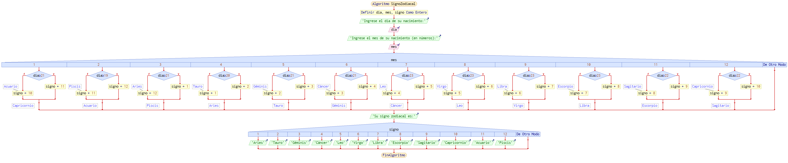

# ALGORITMOS

## Número de lista: 19, correspondiente a los algoritmos 10 y 29


**Algoritmo 10:**

```

Algoritmo SignoZodiacal
    Definir dia, mes, signo Como Entero
	
    Escribir "Ingrese el día de su nacimiento:"
    Leer dia
	
    Escribir "Ingrese el mes de su nacimiento (en números):"
    Leer mes
	
    Segun mes Hacer
			Caso 1:
            Si dia >= 21 Entonces
                signo <- 11 // Acuario
            Sino
                signo <- 10 // Capricornio
            FinSi
			Caso 2:
            Si dia >= 19 Entonces
                signo <- 12 // Piscis
            Sino
                signo <- 11 // Acuario
            FinSi
			Caso 3:
            Si dia >= 21 Entonces
                signo <- 1 // Aries
            Sino
                signo <- 12 // Piscis
            FinSi
			Caso 4:
            Si dia >= 20 Entonces
                signo <- 2 // Tauro
            Sino
                signo <- 1 // Aries
            FinSi
			Caso 5:
            Si dia >= 21 Entonces
                signo <- 3 // Géminis
            Sino
                signo <- 2 // Tauro
            FinSi
			Caso 6:
            Si dia >= 21 Entonces
                signo <- 4 // Cáncer
            Sino
                signo <- 3 // Géminis
            FinSi
			Caso 7:
            Si dia >= 23 Entonces
                signo <- 5 // Leo
            Sino
                signo <- 4 // Cáncer
            FinSi
			Caso 8:
            Si dia >= 23 Entonces
                signo <- 6 // Virgo
            Sino
                signo <- 5 // Leo
            FinSi
			Caso 9:
            Si dia >= 23 Entonces
                signo <- 7 // Libra
            Sino
                signo <- 6 // Virgo
            FinSi
			Caso 10:
            Si dia >= 23 Entonces
                signo <- 8 // Escorpio
            Sino
                signo <- 7 // Libra
            FinSi
			Caso 11:
            Si dia >= 22 Entonces
                signo <- 9 // Sagitario
            Sino
                signo <- 8 // Escorpio
            FinSi
			Caso 12:
            Si dia >= 22 Entonces
                signo <- 10 // Capricornio
            Sino
                signo <- 9 // Sagitario
            FinSi
    FinSegun
	
    Escribir "Su signo zodiacal es:"
    Segun signo Hacer
			Caso 1:
            Escribir "Aries"
			Caso 2:
            Escribir "Tauro"
			Caso 3:
            Escribir "Géminis"
			Caso 4:
            Escribir "Cáncer"
			Caso 5:
            Escribir "Leo"
			Caso 6:
            Escribir "Virgo"
			Caso 7:
            Escribir "Libra"
			Caso 8:
            Escribir "Escorpio"
			Caso 9:
            Escribir "Sagitario"
			Caso 10:
            Escribir "Capricornio"
			Caso 11:
            Escribir "Acuario"
			Caso 12:
            Escribir "Piscis"
    FinSegun
	
FinAlgoritmo

```



**Algoritmo 29:**
