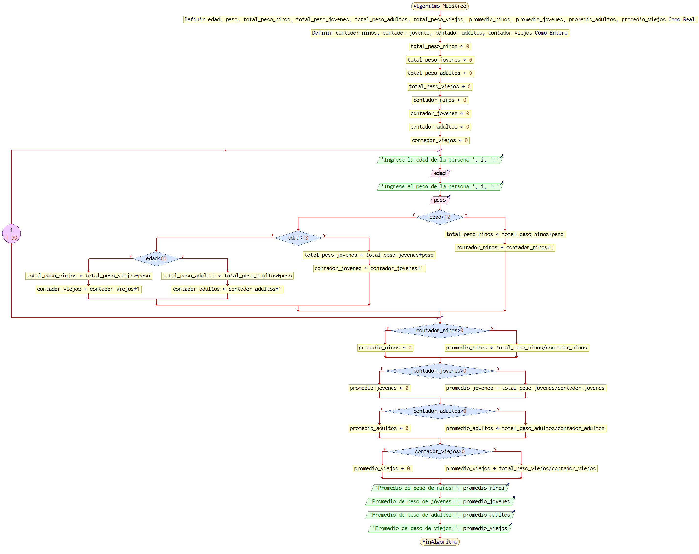

# ALGORITMOS

## Número de lista: 19, correspondiente a los algoritmos 10 y 29


**Algoritmo 10:**

```

Algoritmo SignoZodiacal
    Definir dia, mes, signo Como Entero
	
    Escribir "Ingrese el día de su nacimiento:"
    Leer dia
	
    Escribir "Ingrese el mes de su nacimiento (en números):"
    Leer mes
	
    Segun mes Hacer
			Caso 1:
            Si dia >= 21 Entonces
                signo <- 11 // Acuario
            Sino
                signo <- 10 // Capricornio
            FinSi
			Caso 2:
            Si dia >= 19 Entonces
                signo <- 12 // Piscis
            Sino
                signo <- 11 // Acuario
            FinSi
			Caso 3:
            Si dia >= 21 Entonces
                signo <- 1 // Aries
            Sino
                signo <- 12 // Piscis
            FinSi
			Caso 4:
            Si dia >= 20 Entonces
                signo <- 2 // Tauro
            Sino
                signo <- 1 // Aries
            FinSi
			Caso 5:
            Si dia >= 21 Entonces
                signo <- 3 // Géminis
            Sino
                signo <- 2 // Tauro
            FinSi
			Caso 6:
            Si dia >= 21 Entonces
                signo <- 4 // Cáncer
            Sino
                signo <- 3 // Géminis
            FinSi
			Caso 7:
            Si dia >= 23 Entonces
                signo <- 5 // Leo
            Sino
                signo <- 4 // Cáncer
            FinSi
			Caso 8:
            Si dia >= 23 Entonces
                signo <- 6 // Virgo
            Sino
                signo <- 5 // Leo
            FinSi
			Caso 9:
            Si dia >= 23 Entonces
                signo <- 7 // Libra
            Sino
                signo <- 6 // Virgo
            FinSi
			Caso 10:
            Si dia >= 23 Entonces
                signo <- 8 // Escorpio
            Sino
                signo <- 7 // Libra
            FinSi
			Caso 11:
            Si dia >= 22 Entonces
                signo <- 9 // Sagitario
            Sino
                signo <- 8 // Escorpio
            FinSi
			Caso 12:
            Si dia >= 22 Entonces
                signo <- 10 // Capricornio
            Sino
                signo <- 9 // Sagitario
            FinSi
    FinSegun
	
    Escribir "Su signo zodiacal es:"
    Segun signo Hacer
			Caso 1:
            Escribir "Aries"
			Caso 2:
            Escribir "Tauro"
			Caso 3:
            Escribir "Géminis"
			Caso 4:
            Escribir "Cáncer"
			Caso 5:
            Escribir "Leo"
			Caso 6:
            Escribir "Virgo"
			Caso 7:
            Escribir "Libra"
			Caso 8:
            Escribir "Escorpio"
			Caso 9:
            Escribir "Sagitario"
			Caso 10:
            Escribir "Capricornio"
			Caso 11:
            Escribir "Acuario"
			Caso 12:
            Escribir "Piscis"
    FinSegun
	
FinAlgoritmo

```

Diagrama de flujo:


**Algoritmo 29:**

```

Algoritmo Muestreo
    Definir edad, peso, total_peso_ninos, total_peso_jovenes, total_peso_adultos, total_peso_viejos, promedio_ninos, promedio_jovenes, promedio_adultos, promedio_viejos Como Real
    Definir contador_ninos, contador_jovenes, contador_adultos, contador_viejos Como Entero
	
    total_peso_ninos <- 0
    total_peso_jovenes <- 0
    total_peso_adultos <- 0
    total_peso_viejos <- 0
    contador_ninos <- 0
    contador_jovenes <- 0
    contador_adultos <- 0
    contador_viejos <- 0
	
    Para i <- 1 Hasta 50 Hacer
        Escribir "Ingrese la edad de la persona ", i, ":"
        Leer edad
		
        Escribir "Ingrese el peso de la persona ", i, ":"
        Leer peso
		
        Si edad < 12 Entonces
            total_peso_ninos <- total_peso_ninos + peso
            contador_ninos <- contador_ninos + 1
        Sino
            Si edad < 18 Entonces
                total_peso_jovenes <- total_peso_jovenes + peso
                contador_jovenes <- contador_jovenes + 1
            Sino
                Si edad < 60 Entonces
                    total_peso_adultos <- total_peso_adultos + peso
                    contador_adultos <- contador_adultos + 1
                Sino
                    total_peso_viejos <- total_peso_viejos + peso
                    contador_viejos <- contador_viejos + 1
                FinSi
            FinSi
        FinSi
    FinPara
	
    Si contador_ninos > 0 Entonces
        promedio_ninos <- total_peso_ninos / contador_ninos
    Sino
        promedio_ninos <- 0
    FinSi
	
    Si contador_jovenes > 0 Entonces
        promedio_jovenes <- total_peso_jovenes / contador_jovenes
    Sino
        promedio_jovenes <- 0
    FinSi
	
    Si contador_adultos > 0 Entonces
        promedio_adultos <- total_peso_adultos / contador_adultos
    Sino
        promedio_adultos <- 0
    FinSi
	
    Si contador_viejos > 0 Entonces
        promedio_viejos <- total_peso_viejos / contador_viejos
    Sino
        promedio_viejos <- 0
    FinSi
	
    Escribir "Promedio de peso de niños:", promedio_ninos
    Escribir "Promedio de peso de jóvenes:", promedio_jovenes
    Escribir "Promedio de peso de adultos:", promedio_adultos
    Escribir "Promedio de peso de viejos:", promedio_viejos
	
FinAlgoritmo

```
Diagrama de flujo:




> [*Volver*](Tarea2-3.md)

> [*Pág. Principal*](README.md)
